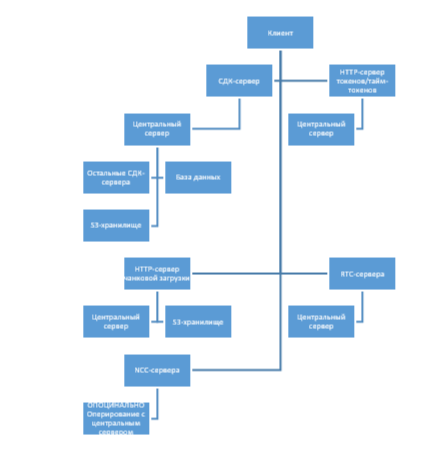

## TODO:
### ТЕРМИНЫ
* CDN - Content Delevery Network
* NCC - No Central Control
* CC  - Central Core
* FTS - File Transmitting Server
* TTG - Time-Tokens Generator
* SCA - Server for Controling Accounts 
* RTC - Real-Time Communications

### Внутрення логика и передача данных
Будет один центральный сервер, на котором будет и база данных. К основному серверу будут подключатся СДК-серверы. К СДК серверам будут подключаться клиенты. Команда, когда будет отсылаться клиентом на сервер, будет проверятся, и если она как-либо взаимодействует с другими пользователями, то в первую очередь СДК сервер будет пытаться отослать её всем связанным клиентом в своей сети, параллельно пересылая центральному серверу. Центральный сервер будет легировать эту команду в соответствии с её типом и содержимом, после пересылать на все СДК-серверы, к которым подключены затрагиваемые клиенты.

### Схематика связи

Так же центральный сервер будет сверяться с базой данных, и искать там не подключённых клиентов. Им он будет отсылать уведомления.

### СДК-сервер отвечает за:
* Уведомление центрального-сервера о своих клиентах
* Получение токена и запрос верификации токена у центрального сервера
* Обработку и пересылку локальным клиентам командам
* Пересылку команд на центральный сервер

### Команды СДК-сервера связаны с:
* Постом/редактированием/удалением обычных сообщений
* Постом/редактированием/удалением сообщений типа пост
* Созданием/удалением/редактирования настроек чатов/групп/каналов/сообществ/гильдий

### HTTP-сервер токенов отвечает за:
* Выдачу/отзыв токенов/тайм-токенов

### Команды HTTP-сервера токенов связаны с:
* По паре логин-пароль генерировать, сохранять и возвращать токен доступа к учётной записи
* По токену доступа генерировать тайм-токен для определённой цели
* По токену доступа отзывать токены/тайм-токены

### Центральный сервер ответственен за:
* Получение команды от одного СДК-сервера и уведомление по необходимости других серверов
* Уведомление офлайн-клиентов
* Логирование команд
* Хранение не локализованных данных
* Оперирование списком NCC-серверов

### Центральный сервер распознаёт команды:
* Уведомления о подключённых/отключённых клиентов СДК-серверов
* Уведомления и пересылки команд от СДК-серверов
* Верификации или оперирования NCC-серверами

# General info
Our goal is to combine the advantages of all the most popular social networks in one application, while keeping off their disadvantages. Also, for the sake of performance, we develop in native code for each platform. Of course, it is highly unlikely that someone would be interested in a school project, but we welcome any sort of help ;)

# Installation
While components are not ready, we advice against trying to install anything

## Server
--no information--

## Linux client
### Build prerequisites:
- Of course, linux
- Qt 6 or higher
- g++ compiler
- GNU make 
- GHC Haskell compiler (not necessary yet)
- ghc-static (not necessary yet)
- patience

### Build steps: 
1. clone the repository & navigate to GigaChat/client/desktop/linux-x11/source
2. `haskell/build-shared.sh` or `cd haskell && ghc -dynamic -shared -fPIE <did not finish the command lol>`  (not necessary yet)
3. run `qmake GigaQt.pro && make`
4. Pray. for it to work.

## Windows client
--no information--

## Android client
--no information--

